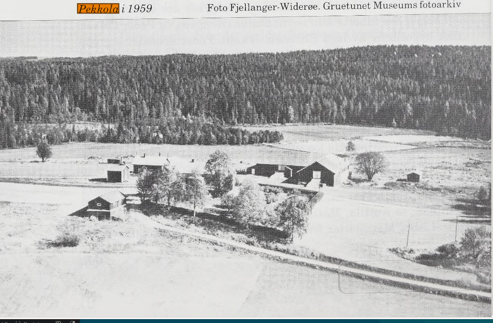

# Skogfinnene fra Finnskogen

I en lengere periode fant jeg ikke min agnatiske slektslinje (fars far osv) lengere tilbake enn min tippoldefar [Peder Pedersen](https://family.knuthp.no/gramps/ppl/5/6/c3073b3c0d663935665.html). Han var innflyttet til Fredrikstad fra Solør var eneste opplysningene jeg hadde. Så en gang i 2025 kom jeg over [Østbyslekt](https://slekt.ostby.priv.no) og jeg fikk da masse skogfinner inn i slekten og noen slektslinjer som går langt tilbake.

Det er ikke entydig at slektslinjen jeg har brukt her stemmer. Boka [Navnsjøboerne](https://www.nb.no/items/325f144b29d44195fd2c70027d42e311?page=147) har en annen forklaring på hvor Peder Pedersen fra Skulstaberget endte opp og fødselsår varier litt i kildene. Bakgrunn for mitt valg er basert på at Peder Pedersen fra Skulstadberget flyttet fra Grue til Fredrikstad i 1845 og at min forfar Peder Pedersen på Traramoen har Grue som fødested når han gifter seg med [Anne Lovise Olsdatter Pedersen](https://family.knuthp.no/gramps/ppl/4/2/c3073e2af862dbca324.html)

En ting jeg hadde lurt på var hvor langt tilbake Pedersen navnet gikk. Det viser seg at det stopper med [Peder Pedersen](/my_family_tree_gramps/ppl/5/6/c3073b3c0d663935665.html) som fikk det av sin far [Peder Danielsen Navilainen](https://family.knuthp.no/gramps/ppl/7/7/100503888524510c257244354577.html). Det viste seg også at Peder kommer av finske Pekka, så det er opphav til mitt etternavn.

## Personer og steder

### Peder Larsen Räisänen

> Peder Larsen Räisäinen regnes som finneinvandringens far i Grue og på Østlandet i det hele tatt. Hans skal ha vært den første finnen som slo seg ned i skogene på norsk side av grensen. 1624 er nevnt av Erik Pontoppidan som året da Peder Larsen bosatte seg på Løvhaugen. Så svært galt er vel dette årstallet ikke, men de fleste vil nå mene at innvandringen begynte noe senere.

> Skogen her tilhørte som nevn Staten (Kongen), og Peder Larsen fikk bygselbrev av fogd Christen Jensen. Peder arbeidet seg opp og ble velstående. I 1657 hadde han 5 hester, 16 kuer, 6 geiter, 16 sauer og 3 griser, og ti år senere sådde han 6 tønner korn.

[Grueboka: Finnskogen](https://www.nb.no/items/6870e73c58c4674a0292a1e93f561729?page=0&searchText="peder larsen")

Peder Larsen Räisänen var født i Savolax, Finland rundt 1600, dermed hadde han kunnskap om hele vandringen til Sverige og videre til Norge.

Fra Peder Pedersen går linjen videre til hans farfars mor som het Räisanen. Så Per Larsen Räisänen er tipp-tipp-tipp oldefar til Peder Pedersen og dermed min 8-tipp oldefar

### Savolax Finnland

### Bekkola/Pekkola, Løvhaugen, Grue Finnskog, Norge
Relevant fra 1624 - 1733

Pekkola er plassen Peder Larsen Räisänen ryddet da han som første finne slo seg ned i skogen på norsk side rundt 1624.

* 1630 - 1733 bor Peder Pedersen sin farfars slekt der.

### Rotneberget (Øvergarden), Grue Finnskog, Norge
Relevant fra 1740 - 1827

> Rydningsmann er trolig Peder Steffensen Navilainen og hans far Steffen Pedersen bosatte seg også på Rotneberget. Peder Steffensen var gift med Ingrid Olsdatter fra Pekkola.

> Ved skifte etter Peder Steffensen i 1748 var det bruttoformue på 62 daler og nettoformue på 57 daler.

[Grueboka: Finnskogen](https://www.nb.no/items/6870e73c58c4674a0292a1e93f561729?page=0&searchText="peder larsen")

* Steffen Persson Navilainen og Karin Mårtensdotter Puttoinen dør her i 1742 begge to. De er tipp-oldeforeldre til Peder Pedersen
* Peder Steffensen Navilainen og Ingrid Olsdatter Räisänen dør her i 1748 og 1759. De er oldeforedre på farfarsiden til Peder Pedersen
* Daniel Pedersen Navilainen blir født her i 1735 og dør her i 1827. Han er farfar til Peder Pedersen

### Bjørsjøtorpet

### Skulstad

* Daniel Pedersen og Gjertrud Thomasdatter Mången bor her i Folketellingen 1801. De er farmor og farfar til Peder Pedersen
* Peder Danielsen i Folketellingen 1801. Han er far til Peder Pedersen

### Skulstadberget

> Skulstadberget ligger ca 2km øst for Navnsjøen og ca 40 meter høyere. De var Daniel Pedersen Navailainen f. 1735 fra Rotneberget som først ryddet og bosatte seg i Skulstadberget sammen med sin kone Gjertrud Tomasdotter (1736-1828) fra Mången, Sverige. Dette skjedde i første halvdel av 1760-tallet. Skulstadberget er således en av de eldste boplassene i Navnsjøgrenda. Daniel var av Räisäinen-slekta, hasn foreldre var Ignrid Oldatter Räisänen og Peder Steffensen Navilainen (1701-1748). Daniel og Gjertrud fikk 3 barn.

Navnsjøboerne boka.

* Gjertrud Thomasdatter dør her i 1828. Hun er farmor til Peder Pedersen
* Peder Danielsen blir født her i mellom 1769 og 1775 og dør her i 1833. Han er far til Peder Pedersen

## Skulstadmoen

* Berthe Andersdatter dør her i 1836. Hun er mormor til Peder Pedersen

### Kingelsrud

* Ole Nilsen født her 1745. Han er morfar til Peder Pedersen.
* Karen Olsdatter født her 1783. Hun er mor til Peder Pedersen

### Møllerud

* Berthe Andersdatter blir født her i 1747. Hun er mormor til Peder Pedersen

### Dal

* Svenning Nilsen Dal blir født her i 1681. Han er tipp-tipp oldefar til Peder Pedersen på morfars siden.

## Skogfinner i Hurdal
[Skogfinner i Hurdal](https://www.skogfinneforeningen.no/1-lokalhistorisk/23-akershus/33-hurdal/157-hurdal-historier) av Skogfinneforeningen

### Rognlia
[Embret Kristensen Steinsjøen](/gramps/ppl/f/1/c30d4f6805e546d531f.html) født siste halvdel 1600 tallet var bruker på [Rognlia](/gramps/plc/3/2/cb735e9d6140ae1b523.html) og regnes som skofinne i Hurdal Bygdebok Bind 2: [Gaards og slektshistorie](https://www.nb.no/items/URN:NBN:no-nb_digibok_2009022400053)

### Finneplasser som slekt har levd på i litt nyere tid
1. [Solsrud](/gramps/plc/d/2/cb8600fa8645771962d.html)
2. [Buraas](/gramps/plc/d/0/cb83a4c3c090e58a00d.html)
3. Skrukklia (usikker hvem som levde der, ingen plass referanse i Gramps)

