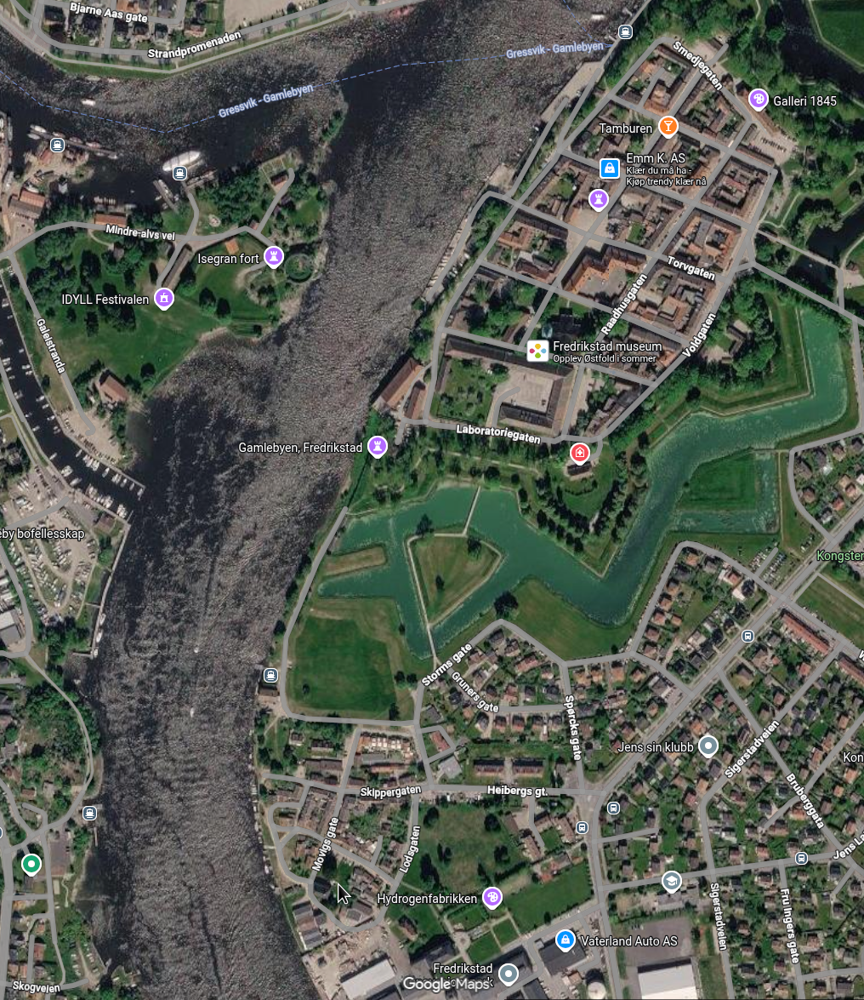
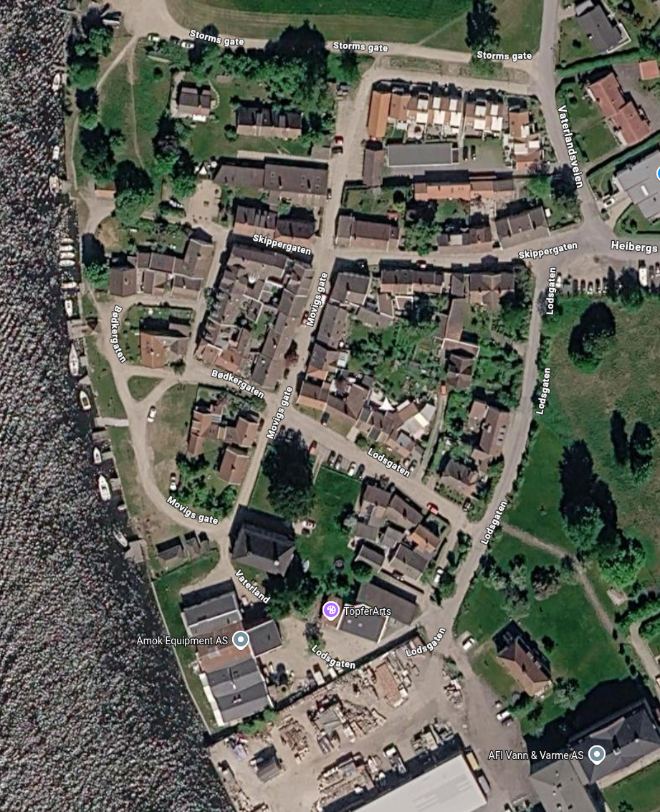
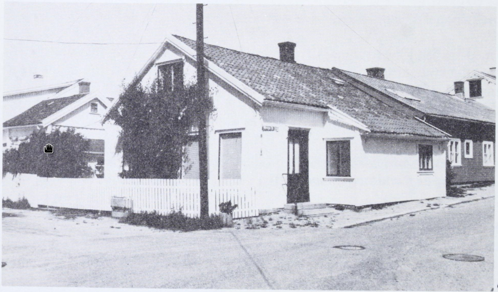
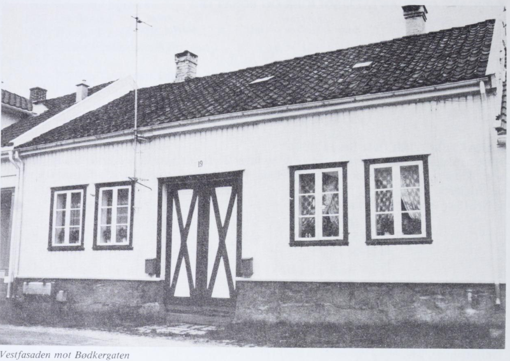
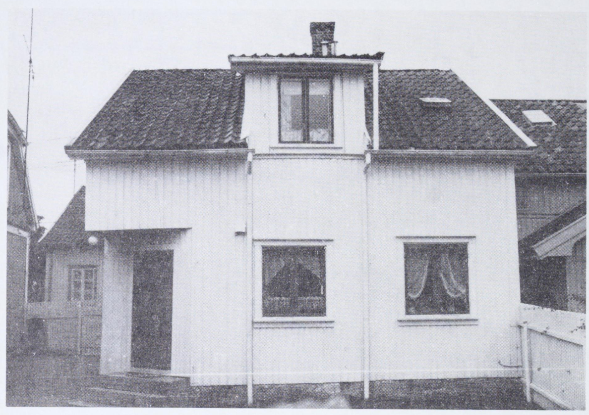
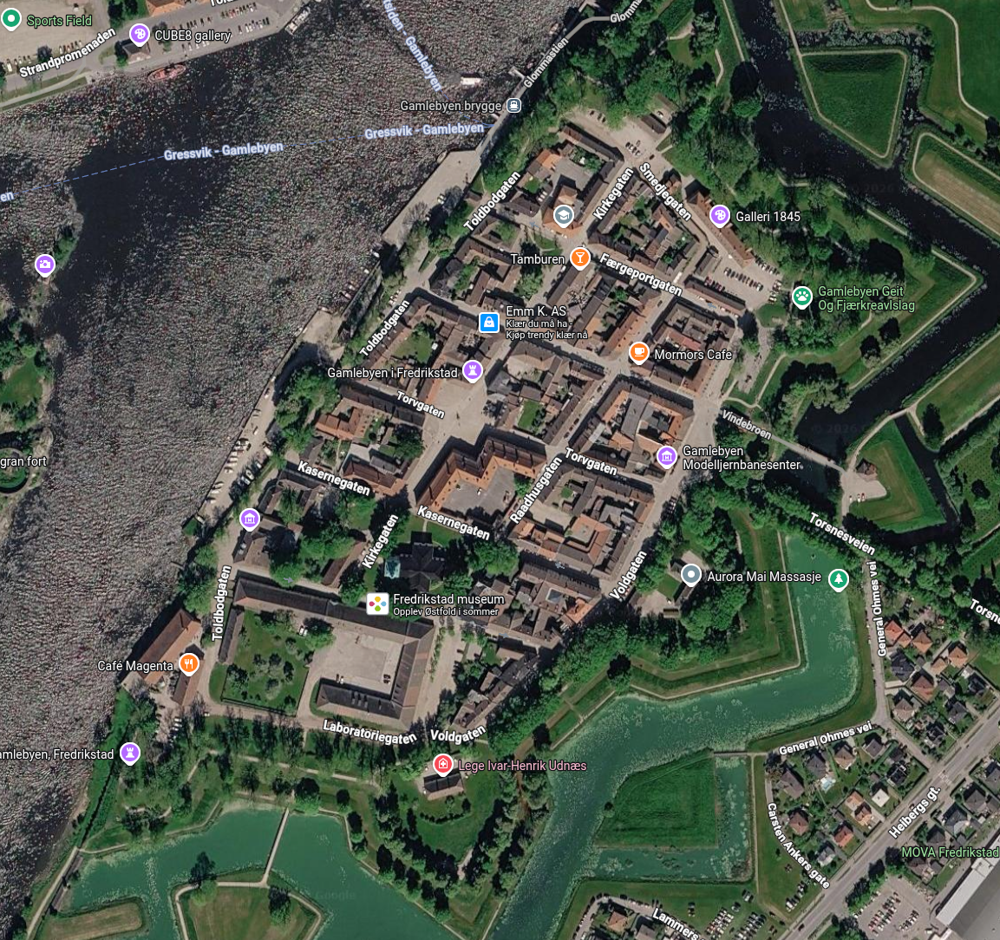

# Fredrikstad

## Slekt som har bodd der.
Fredrikstad er en by i vekst på 1800 tallet. Både Knut og Gunhild har slekt som lever der samtidig.

Knut's tipp-oldefar Peder Pedersen flytter dit i 1835 og finner sin kone der. Og oldefar Kristian Pedersen bor der i hele sitt liv og farfar Asbjørn
Pedersen vokser opp der.

## Traramoen

Gunhild's tipp-tipp-oldefar Christen Dahl flytter til Fredrikstad med sin kone Randi og tipp-oldefar Oluf Petter Dahl vokser opp der frem til han dør bare 33 år gammel. Hans kone Emilie Hansine Alette Dahl bor der, men flytter og ender opp på Høvik. Emilie Hansine Alette Dahl sine foreldre Hans Mathisen og Marie Mathisen er født og bor hele sitt liv i Vaterland.


### Slektstre Gunhild slekt

```
                        Nils Thomesen   Helge Rasmusdatter  Michel Kjøstolsen    Berthe Jonsdtr.    Nils Bøckmann----------------Guri Larsdatter
                        Arbejdsmand     -                   Arbejdsmand          -                  Snekkermester                -
                        ? - ?           ? - ?               ? - ?                ? - ?              Sverige                      Skjeberg?
                        ? - ?           1754 - ?            1753 - ?             1758 - ?           1740 - ?                     ? - ?
                          |---------------|---|                 |--------|-----------|                  |
                                              |                          |                              |
                                          Mathis Nilsen         Anne Cathrine Michelsdtr            Niels Nilsen Bøckmann--------Hedvig Larsdatter
                                          Matros                -                                   Snekkermester                -
                                          Fredrikstad - ?       Fredrikstad                         Fredrikstad - Fredrikstad    ? - ?
                                          1794 - ?              1793 - ?                            1791 - 1871                  ? - 1883
                                               |------------------------|                               |
                                                                        |                               |
            Christen Pedersen Dahl -------Randi Dahl            Hans Mathisen-----------------------Alette Marie Mathisen
            Bagermester                   -                     Los                                 -
            Rommedal - Fredrikstad        Kongsvinger - Fredri  Fredrikstad - Fredrikstad           Fredrikstad -
            1821 - 1900                   1824 - ?              1828 - 1907                         1840 - ?
                |                                                       |
                |                                                       |
            Oluf Petter Dahl------------------------------------Emilie Hansine Alette Dahl
            Bager                                               Jordmor
            Hamar - Fredrikstad                                 Fredrikstad - Bærum
            1855 - 1888                                         1860 - 1945
                |
                |
            Hans Oluf Petter Dahl---------Margit Nathalie Dahl
            Assistent Geogr. oppmåling    -
            Fredrikstad - Bærum           Oslo - Bærum
            1888 - 1978                   1891 - 1974
                |
                |
            Gunnar Oluf Dahl
            Bærum - Bærum
            1917 - 2010

```

1. Hans Mathisen var gift med Alette Marie Mathisen, før dette var han gift med Alette sin søster Emilie som var 9 år eldre.
2. Oluf Petter Dahl dør før sønne Hans Oluf Petter Dahl blir født.
3. Anna Catarine Michelsdtr sin far er oppgitt som "Udlagt til barnefader" som betyr at mor har navngitt denne personen som barnefar. De bor sammen i 1801, så trolig er de et par, men ikke gift. Bosted ved barnets fødsel er også spennende "Hos borgemæsteren".


### Folketellinger/Fødsler etc

1. 1801 Uden for byen - Bostedsnr 8. No. 273 (Michel Kiøstelosen og Berthe Joensdatter med barnet Anne Cathrine Michelsdatter) Totalt 4 personer  [Folktellingen 1801](https://www.digitalarkivet.no/gf01058191001803)
1. 1801 Vaterland - Gårdens nummer 246 (Bosted 0026) (Nils Thomesen og Helge Rasmusdatter med barnet Mathis Nilsen og 1 annet barn) Total 5 personer. [Folktellingen 1801] (https://www.digitalarkivet.no/gf01058191001701)
1. 1828 Vaterland - Myhra Hans Mathisen fødes der.
1. 1865 Vaterland - Bødkergata 19: Gårdens nummer 249 - (Bosted 323 i folketellingen) (Hans og Alette Marie Mathisen med barnet Hansine Alette og 3 andre barn) Totalt 12 personer i gården [Folktellingen 1865](https://www.digitalarkivet.no/gf01037981004725)
1. 1865 Byen - Gårdens nummer 107 (Christen og Randi Dahl med barnet Oluf og 2 andre barn) Totalt 17 personer i gården. [Folketellingen 1865](https://www.digitalarkivet.no/gf01037981001480
1. 1870 Byen - Færgeports Gade 127-131 (Christen og Randi Dahl med barnet Oluf Petter) [Folktellingen 1870](https://www.digitalarkivet.no/gf01053318000122)
1. 1870 Vaterland - Bødkergata 19: Gårdens nummer 249 (Hans Mathisen med Emilie og 3 andre barn) Totalt 9 personer i gården. [Folktellingen 1870](https://www.digitalarkivet.no/pf01053318001795)
1. 1875 Vaterland - Bødkergata 19: Gårdens nummer 19 Hans Mathisen bor der med datteren Emilie samt 2 andre barn. Totalt 10 personer. (Gårdens eier er Peter Christensen Dahl) [Folktellingen 1875](https://www.digitalarkivet.no/gf01052006001854)
1. 1875 Byen - Færgeportgade: Gårdens nummer 80 (Christen og Randi Dahl med barnet Oluf Petter samt 2 andre barn) (Gårdens eier er Smed C. Larsen) [Folktellingen 1875](https://www.digitalarkivet.no/gf01052006001450)
1. 1885 Byen - Voldgade: Gårdens nummer 10 (Christen og Randi Dahl med Oluf) Totalt 15 personer i gården (Gårdens eier er Fattigforstander Jensen) [Folketellingen 1885](https://www.digitalarkivet.no/gf01053251009180)
1. 1891 Byen - Bostedsnr 58 (Emilie Dahl med barnet Hans og 2 andre barn samt Emilies far Hans Mathisen) Totalt 33 personer. [Folktellingen 1891](https://www.digitalarkivet.no/bf01052671000295)
1. 1891 Byen - Bostedsnr 73 (Christen og Randi Dahl) Totalt 14 personer. [Folketellingen 1891](https://www.digitalarkivet.no/bf01052671000295)
1. 1900 Byen - Kasernegade: Gårdens nummer 52 (Christen og Randi Dahl) 4 leiligheter på 1 etasje, Total 13 personer.   [Folkeltellingen 1900](https://www.digitalarkivet.no/gf01036995001116)
1. 1910 Byen - Voldgate 4 (Randi Dahl som Hospitalslem) 2 Leiligheter på 2 etasjer, Totalt 18 personer  [Folktellinge 1910](https://www.digitalarkivet.no/gf01036335000053)


## Vaterland

Navnet Vaterland kommer trolig fra tysk Vaderlant/Vaterland og ble bruk som en betegnelse på et "fristed" utenfor byens jurisdiksjon og skatter.

> Vaterland er en del av Fredrikstad by som ligger rett sør for Gamlebyen. Den er preget lav trehusbebyggelse fra 17- og 1800-tallet. Vaterland består idag av bebyggelsen som ligger til gatene Lodsgaten, Skippergaten, Bødtkergaten og Movigsgate. Vaterland oppsto opprinnelig som en forstad til byen innenfor vollene. Navnet stammer trolig fra nederlandsk og hentyder på et flatt, lavtliggende sumpland.
>
> Vaterlands Historie
> Vaterland opptrer i kildene først i 1666, men det kan allerede ha vært bebyggelse her før det. Etter bybrannen i 1653 flyttet trolig en del av byens fattige hit, og etter at det permanente festningsanlegget ble påbegynt i 1660-årene, er det sannsynlig at flere har flyttet ut av byen. Trehusbebyggelsen utenfor festningsvollene bød på bekymring, og i 1682 fikk stattholder Ulrik Frederik Gyldenløve gjennom at det kun skulle settes opp trehus i Vaterland hvis eierne på forhånd hadde bygget murhus innenfor vollene. Det skulle vise seg vanskelig å gjennomføre og det ble gitt tillatelse til enkelte sjøfolk å bygge i Vaterland.
>
>Gjentatte bybranner og påbud om murtvang i byen førte til at flere slo seg ned i Vaterland, igjen i konflikt med de militære myndighetene i byen. Under Den store nordiske krig i 1712 var det frykt for et svensk angrep, og kommandant Peter Jacob Wilster beordret bebyggelsen i Vaterland skutt i brann for å sikre festningens forterreng.
[Wikipedia](https://lokalhistoriewiki.no/Vaterland_(Fredrikstad))

1. [Wikipedia](https://lokalhistoriewiki.no/Vaterland_(Fredrikstad))
2. [Miljøbevaring i Vaterland. Utg. Bevaringskomitéen for Vaterland. Fredrikstad. 1981.](https://www.nb.no/items/e7dc6fa8735a8c7ae23d1046f2a86648?page=0&searchText=Miljøbevaring i Vaterland)


### Oversiktskart Gamlebyen og Vaterland



### Oversiktskart Vaterland



### Myhra

i Pladsen Myhra paa Byens Grund

1. 1819 Mathis Nilsen, Anne Cathrine Mikelsdatter (barn født Maren Helene)
1. 1828 Mathis Nilsen, Anne Cathrine Mikelsdatter (Hans Mathisen blir født)


### Movigsgate 27

* Tidligere matrikkel nr. 246
* Tomteareal: 174.29 m2



Eies i

* 1797 Niels Thomesen

[Miljøbevaring i Vaterland : en forstad til festningsbyen Fredrikstad](https://www.nb.no/items/e7dc6fa8735a8c7ae23d1046f2a86648??page=165) side 162

### Bødkergaten 19

* Tidligere matrikkel nr. 249.
* Tomteareal 184.5 m2




Eies i

* 1817 Niels Thomesen
* 1827 Niels Thomesen enke


[Miljøbevaring i Vaterland : en forstad til festningsbyen Fredrikstad](https://www.nb.no/items/e7dc6fa8735a8c7ae23d1046f2a86648?page=133) side 131

### Skippergaten 3

* Tidligere matrikkel nr 240B.

[Google Streetview](https://maps.app.goo.gl/8cVzzteYi2kvAA6E9)




Relaterte personer

* 1805 Niels Bøckmann og Guri Larsdatter med barnet Niels Nielsen Bøckmann
* 1817 Guri Larsdatter

Eies i

* 1805 Niels Bøckmann,
* 1817 Guri Larsdatter, enke etter Niels Bøckmann
* 1844 Nils Bøckmann (Trolig barn som ikke er direkte i slektsrekken)


Guri Larsdatter lånte i 1806 50 riksdaler av kjøpmann Peter Bull mot pant i hennes eiendom matrikkelnr 240 i Vaterland. Beløpet ble anvendt til å betale gjeld som hennes avdøde mann Niels Bøckmann, hadde pådratt seg og for at "de forekomme at huset og løsøret ikke skulde blive solgte eller utlagte".

Protokoll fra taksasjonsforretning på eiendommen:

> Anton Wilhelm Scheel, byfogd og ene magistrat i Friderichstad i Norge, gjør vitterlig: At år 1807 den 9. januar ble en taksasjonsforretning avholdt over gården nr. 240 i byens forstad Vaterland beliggende. Forretningen fremmet av byfogden med de utnevnte edsvorne laugrettes- og taksasjonsmenn S. Lassen, Holth, Sollie og J. Møller etter forlangende av enken Guri Larsdatter, enke etter Niels Bøckmann som tilkjennega at behøve denne forretning i betryggelse mot panthaveren. Taksasjonsmennene befat at gården besto av et vånhus av tømmer en etasje, hvori en stue og kjøkken med 2 fag vinduer i stuen, en 1-etasjes ovn. I gården et fehus og et vedskjul av tømmer og bord, samt dertil en liten hage.
>
> Denne gård som beskreven med tomt, ble anført verd 90 rd., sier nitti riksdalder og er samme i Brannkassen forsikret for 50 rd. Mot den satta takst hadde forretningsføreren intet at innvende.


[Miljøbevaring i Vaterland : en forstad til festningsbyen Fredrikstad](https://www.nb.no/items/e7dc6fa8735a8c7ae23d1046f2a86648?page=83) side 81

## Fredrikstad Gamlebyen

### Oversiktskart Gamlebyen



### Færgeportsgate 127 - 131

Relaterte personer

* 1870 Christen og Randi Dahl med barnet Oluf Petter
* 1875 Christen og Randi Dahl med barnet Oluf Petter og 2 andre barn

### Kasernegade

Gårdens nummer 52

Relaterte personer

* 1900 Christen og Randi Dahl

### Voldgade

Relaterte personer

* 1885 Christen og Randi Dahl med barnet Oluf Petter

### Voldgade 4

Relaterte personer

* 1910 Randi Dahl som Hospitalslem