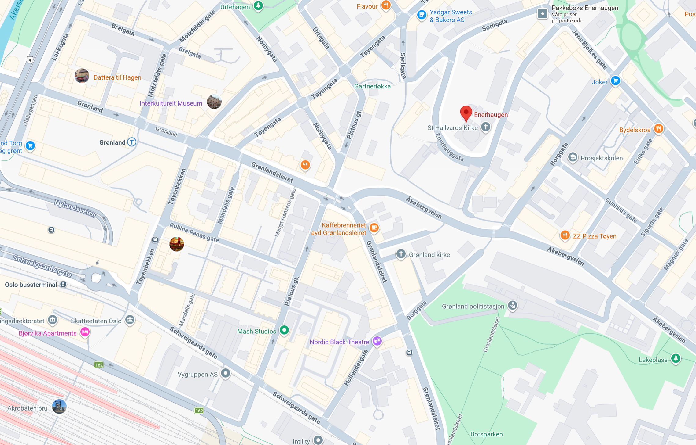

## Enerhaugen

Enerhaugen var tidligere et strøk med småhus der det bodde mange på få rom/kvadratmeter.
Noen av husene er flyttet til Folkemuseet og en kan derfor få inntrykk av hvordan man bodde i gamle dager.

### Smedgata 18
[Signe Emilie Henriette Jensen](gramps/ppl/6/c/10027dafee9523059fd1557633c6.html) ble i 1898 født i Smedgata 18 på Enerhaugen. Hun er min kones oldemor på farfar siden. De flyttet i før 1900 til Nesodden der hennes far  [Oscar Toralf Martinius Jensen](gramps/ppl/0/8/10027e2039b337460f1bab2dcf80.html) jobbet som bødker (tønnemaker) på petroleums fabrikk. Trolig også han som var med på hvalfangst.

### Flisb gata 6
[Oscar Toralf Martinius Jensen](gramps/ppl/0/8/10027e2039b337460f1bab2dcf80.html) bodde her da han ble konfirmert i 1888. Han står da oppført som ugift bødkersvenn.

### Langleik 11
[Otilde Mariane Jensen (født Syversen)](gramps/ppl/e/0/102b1bcd186b5fb7618fe4b6310e.html) ble født der og bodde der når hun giftet seg med  [Henrik Oskar Jensen](/gramps/ppl/b/b/102b1bb35f89d40f8ff88d777bb.html)

[Wikipedia](https://no.wikipedia.org/wiki/Langleiken_(Oslo))

### Folkemusset
[Norsk Folkemuseum - Enerhaugen](https://norskfolkemuseum.no/enerhaugen) har flere hus som opprinnelig stod på Enerhaugen

1. Flisberget 2
2. Johannesgate 12 og 14
3. Johannesgate 4
4. Stupinngata 10

