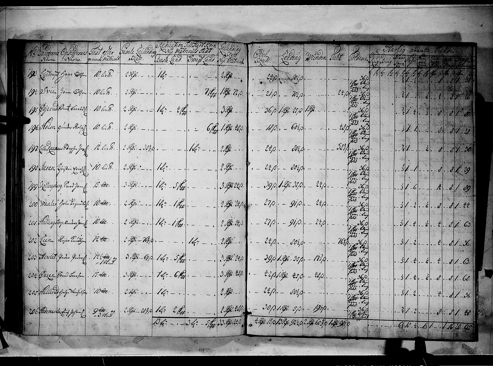
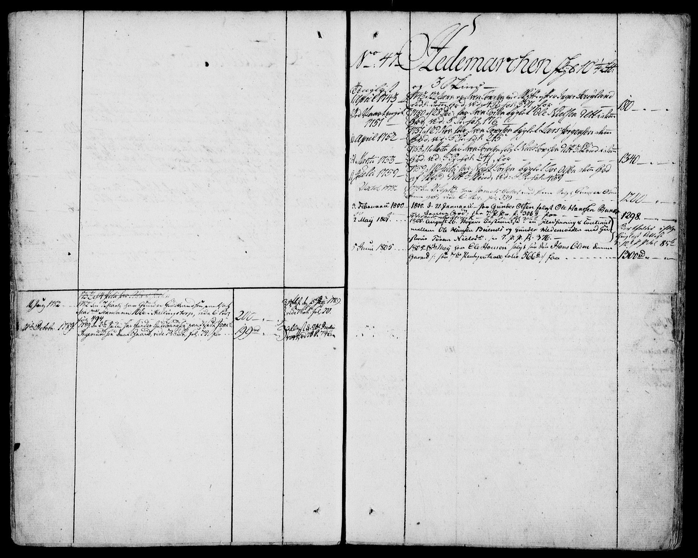

## Hedemarken eiere

<table>
    <thead>
        <tr>
            <th>Fra</th>
            <th>Til</th>
            <th>Sikkert År</th>
            <th>Navn</th>
            <th>Ervervet</th>
            <th>Kommentar</th>
        </tr>
    </thead>
    <tbody>
        <tr>
            <td></td>
            <td></td>
            <td>1676</td>
            <td>Peder Rasmussen og Astri Pedersdatter</td>
            <td></td>
            <td>Fra Heggen og Frøland sorenskriveri I, AV/SAO-A-11556/H, 1667-1811, <a href="https://www.digitalarkivet.no/view/27/pa00000000856350">s. 2113</a></td>
        </tr>
        <tr>
            <td></td>
            <td></td>
            <td>1685</td>
            <td>Peder Rasmussen og Birte Halvorsdatter</td>
            <td></td>
            <td>Fra Heggen og Frøland sorenskriveri I, AV/SAO-A-11556/H, 1667-1811, <a href="https://www.digitalarkivet.no/view/27/pa00000000856351">s. 2115</a></td>
        </tr>
        <tr>
            <td></td>
            <td>1717</td>
            <td>1717</td>
            <td>Rasmus Pedersen og Guri Halvorsdatter</td>
            <td></td>
            <td>Fra Heggen og Frøland sorenskriveri I, AV/SAO-A-11556/H, 1667-1811, <a href="https://www.digitalarkivet.no/view/27/pa00000000856352">s. 2117 </a></td>
        </tr>
        <tr>
            <td>1723</td>
            <td></td>
            <td>1723</td>
            <td>Erik? Johansen?</td>
            <td></td>
            <td>Fra <a href="https://www.digitalarkivet.no/ma00090818640441">Matrikkelprotokoll fra 1723</a> . Nr 206. Årlig tiende er angitt.</td>
        </tr>
            <td>1775</td>
            <td>1800</td>
            <td>1779</td>
            <td>Gunder Olsen Hedemarken og Taran Nilsdatter</td>
            <td></td>
            <td>
                

                    Bygget gml fjøset og fikk penger av arveprins Fredrick. (Salg omtales i <a href="https://www.digitalarkivet.no/tl20080609060076">Panteregister H&F</a> )
                

                

                    Heggen og Frøland sorenskriveri I, AV/SAO-A-11556/H, 1667-1811, <a href="https://www.digitalarkivet.no/sk11216062102121">s. 2121</a>
                    fol 99a - 101a
                     
                    1800 15/5 - 5/11
                     
                    Fra skiftet står at alle deres barn er døde.
                     
                    Søsken Christopher Olsen i Askim med barn Gunhild Christophersdatter 19år.
                     
                    Halvbror Christian Olsen Brandsrud.
                     
                    Søsken Anne Olsdatter Skjæringsrud, Trøgstad.
                    barn:
                        <ol>
                            <li>Ole Syversen - 20</li>
                            <li>Gunhild - 24</li>
                            <li>Helene - 22</li>
                            <li>Maria</li>
                        </ol>
                    Tilstede konens svoger Ole Hansen Bunes som har overtatt løpenr per kontrakt 28-1-1800, skjøte på Hedemarken .. 3/2-1800
                

            </td>
        </tr>
        </tr>
            <td>3.2.1800</td>
            <td>5.6.1805</td>
            <td>1801</td>
            <td>Ole Hansen</td>
            <td></td>
            <td>Svoger til Gunder Olsen, Ole Hansen tinglyst kjøper 3 februar 1800 ( Panteregister H&F ) Stemmer også med folketellingen 1801 da sønnen til eierens navn er Niels Olsen. Bunes ser ut til å være nevnt i Panteregisteret og det er en husbonde på Bunes Søndre i folketellingen 1801  Han har også en sønn som heter Hans Olsen som bor på Bunes i folketellingen 1801. Mulig han arver gården (eldre enn Niels Olsen)
             
            Heggen og Frøland sorenskriveri I, AV/SAO-A-11556/H, 1667-1811, <a href="https://www.digitalarkivet.no/sk11216062102121">s. 2121</a>
            </td>
        </tr>
        </tr>
            <td>1846</td>
            <td>1858</td>
            <td>1858</td>
            <td>Ole Hansen 
Anne Lovise Jakobsdatter (1 kone) 
Helene Gudbrandsdatter (2 kone)</td>
            <td>Arv</td>
            <td>Født i Eidsberg Flytter til gården Børsvolden/Børgsvolden? på Toten våren 1857 (fra skjøte til Anders Brynhildsen 1858 i pantebok) RootsWeb info  Han var først gift med Anne Lovise Jakobsdatter og fikk to barn. Han giftet seg så med Helene Guldbrandsdatter. Faren Hans Olsen er også med på flyttelasset.
             
            Ole Hansen bor på Børsvolden på Toten i folketellingen 1865 . Hans far Hans Olsen er da ikke nevn.
             
            Ole Hansen selger Børsvolden på Toten i 1869 ( Pantebok )
             
            Børsvolden ser ut til å være en bedre gård enn Hedemarken, den har skyld 8 daler - 0 ort - 11 skilling ( Matrikkelen 1886 ) eller 12 mark 65 øre ( Pantebok )
            </td>
        </tr>
        </tr>
            <td>1858</td>
            <td>1869</td>
            <td>1865</td>
            <td>Anders Brynhildsen (Bryngelsen oppgitt i folketelling 1865)</td>
            <td></td>
            <td>
                Født i Sverige. (fant ingen død/innflytting mellom 1864 til 1878 i Eidsberg kirkebok eller 1879 - 1900 i Hærland kirkebok som sier noe om at det var eierskifte i denne tiden)
                En datter av gårdbruker A. Brynhildsen dør på Hedemarken 7 mars 1864.
                Anders Brynildsen Hedemarken (nr 2957A) fra Eidsberg (herl. annex) emigrerer til Amerika 13.08.1869 fra Oslo med reisemål Prescot. Oppgitt alder er 57 år og gift. Han har 248,10 Spesidaler (som virker til å være et bra beløp) Argo linjen ( http://digitalarkivet.no/cgi-win/webcens.exe?slag=visbase&sidenr=36&filnamn=EMIOSLO&gardpostnr=11462&merk=11462#ovre )
                Hans kone Sofie Rasmussen (48 år) og barna Marcus (19), Sinila (15) og Halvar (11) er også Johan Andreasen 42 år utvandret 10 april 1868 fra gården Hedemarken sammen med Reol Andersen (21) og Andreas Andersen (17) til Prescot Wisconsin  http://www.norwayheritage.com/p_list.asp?jo=2145 Passenger list s/s Oder fra Christiania til Hull, Christiania Politikammer emigrasjonsprotokoll 2. Reol og Andreas var hans sønner ref folketellingen 1865 for Hedemarken.
                 
                Heggen og Frøland sorenskriveri I, AV/SAO-A-11556/H, 1667-1811, <a href="https://www.digitalarkivet.no/sk11216062102123">s. 2123</a> Nevner Tosten Brynhildsen og barn Anders 23 år i 1803 med Braathen som undertekst, mulig kobling?
                 
                Anders Brynhildsem og Sophie Rasmusdatter blir <a href="https://www.digitalarkivet.no/view/255/pd00000022542966">foreldre til Marie Emilie 1862-02-19</a>
            </td>
        </tr>
        </tr>
            <td>1869</td>
            <td>1887</td>
            <td>
                1873 
                1886
            </td>
            <td>
                Hans Hansen 
                Kristine Kristinesdatter
            </td>
            <td></td>
            <td>
                Hans Hansen født på Søndre Grindstad i Rakkestad. Faren fikk økonomiske problemer og Søndre Grindstad måtte selges på auksjon. Hans Hansen var trolig mølner av yrke. Han bodde på plassen Mjølnerhaugen i Rakkestad i 1865. 
                Hans Hansen døde i 1886, kona blir boende på Hedemarken hos sin sønn/svigerdatter til sin død i 1901. Føderaadskone i 1900 folketellingen.
            </td>
        </tr>
        </tr>
            <td>1889</td>
            <td>1900</td>
            <td>8.12.1944</td>
            <td>
                Hans Hansen Hedemarken 
                Anette Andreasdatter Hedemarken
            </td>
            <td>Arv</td>
            <td>
	  	        Sønn av forrige eier. Gift i 1887, barn i 1889 som er død på Hedemarken
            </td>
        </tr>
        </tr>
            <td>8.12.1944</td>
            <td>15.03.1947</td>
            <td></td>
            <td>
                Hans Gabriel Langebrekke 
                Kristine Hedemarken Langebrekke
            </td>
            <td>Arv</td>
            <td></td>
        </tr>
        </tr>
            <td>15.03.1947</td>
            <td>30.01.1985</td>
            <td>1950</td>
            <td>
                Hans Kristian Langebrekke 
                Astrid Synnøve Langebrekke
            </td>
            <td>Arv</td>
            <td></td>
        </tr>
        </tr>
            <td>30.01.1985</td>
            <td>23.12.2004</td>
            <td></td>
            <td>
                Finn Even Pedersen 
                Inger Johanne Langebrekke Pedersen
            </td>
            <td>Arv</td>
            <td></td>
        </tr>
        </tr>
            <td>23.12.2004</td>
            <td>d.d.</td>
            <td></td>
            <td>Hans Kristian Hedemarken</td>
            <td>Arv</td>
            <td></td>
        </tr>
    </tbody>
</table>

### Øvre Hedemarken
Skylddeling i 1850

#### Folketellinger
1. [Folketellinge 1891](https://www.digitalarkivet.no/census/rural-residence/bf01052684000864)

### Forpaktere

> Se Indre Smaalene osv

### Nedre Hedemarken
Virker som om skylddelingen skjer 1850.

1. Thor Jørgensen og Birthe Marie Brynhildsdatter får barn i 1860, 1863, 1867 på Hedemarken
1. Johan Torsen og Helene Marie Hansdatter for flere barn på Nedre Hedemarken 1880 og utover.

#### Folketellinger
1. [Folketellingen 1891](https://www.digitalarkivet.no/census/rural-residence/bf01052684000866)

## Panteopplysninger

Panteboken inneholder gjenparter og avskrifter av tinglyste dokumentervedrørende fast eiendom. Panteboken er kronologisk sortert. Grunnboken/panteregister er sortert per gård, med referanse til panteboken. Les mer om pantebøker

### Skattematrikkel 1647 - Bind I

http://da2.uib.no/cgi-win/WebBok.exe?slag=lesbok&bokid=skattostfold1647

Her finner jeg ikke Hedemarken direkte nevnt. En husmann har navn Steffen Hee(march)enn på side 47 og bakerst i indeks viser Hedemarken (Heemarchenn) til side 47. Ørken og Føringsås (Ørchen och Fyrisaas) er nevnt under Ødegårder (Øddegaarder) s 46. Dal (Dall) er nevnt under fullgårder s 43. På denne tiden er de fleste gårdene drevet av leilendinger. De leide skyldsatt eiendom av jordeier. Av skattematrikkelen 1647 ser vi at Steen Willumsen (Rosenwinge) var jordeier på mange av gårdene rundt Hedemarken (Ørken/Føringsås,  Holmb, Elgetun, Bjørnstad, Røstad, Skubberud, Homstvedt, Dal, Trømborg, Åsgård, Søndre Mysen, Haug, Lysaker, Huseby, Breche i Rakkestad). I 1639 var Steen Willumsens eiendom landets tredje største gård med hensyn til areal, kun forbigått av Hafslund og Sem (lokalhistorie).Steen Willumsen Rosenvinge var blant annet Krigskommisær i Norge 1641 og eide setegården Tosegård  ved Fredrikstad. Han døde i 1647.

### Fodregnskap 1695

http://arkivverket.no/URN:db_read/db/44409/213/

Hedemarchen, i Eidsberg Prestegjeld, Hærland Annex.

Mulig det er oppgitt eiere here, men klarer ikke å tyde.

http://arkivverket.no/URN:db_read/db/44409/224/

Hedemarchen er ikke nevnt under sagmesterskatt dette året.

### Sølvskatten 1816

http://arkivverket.no/URN:db_read/db/52593/44/

Hans Olsen står oppført på Hedemarken med 12 spesidaler

### Matrikkelregister 1838

Østfold fylke, Smaalenenes amt, Matrikkel, 1838 s. 82

http://www.arkivverket.no/URN:db_read/db/35474/143

Hedemarken er nevnt som en gård med oppsitter Hans Olsen. Nytt matrikkelnummer er 208, gammel matrikkelnummer er 47. "Heidaamorf" er nevnt som et navn i parentes. Matrikkelskylden er satt til 2 skylddaler, 3 ørt, 20 skilling. Løpenummer er 307.

### Panteregister Heggen og Frøland Protokollnummer 1 1689 - 1737

http://www.arkivverket.no/URN:tl_read?idx_id=20434&uid=ny&idx_side=-96

* 27 mars 1698 - 1898 den 19 Nov for ? ? Obligasjon solgt ? til Peder? ? 16 ort? for 176?
* 29 ??? 1698 - 1698 den 20 April fra ? ? solg ???????
* 29 juni 1699 - 1699 den 8 ? for solgt til 18 ort for 173? 100?
* 20 desember 1717 - 1717 den 12 november ?????? 40 ?
* 31 Mars? 1718 - 1718 den 24 januar ??????? 140 ?
* 10 juli 1734 - 1733 den 8 feb ???? 80

Kildeinformasjon: Protokollnummer: 1, Sted: Heggen og Frøland sorenskriveri, Oppbevaringssted: SAO

Merknader: Trøgstad fol. 1, Askim fol. 78, Eidsberg fol. 123. Atkomster 1689-1737. Alle registre ordnet alfabetisk etter gårdsnavn.

Permanent bildelenke: http://www.arkivverket.no/URN:NBN:no-a1450-tl20080609050096.jpg

Permanent sidelenke: http://www.arkivverket.no/URN:tl_read?idx_id=20434&uid=ny&idx_side=-96

### Panteregister Heggen og Frøland Protokollnummer 7 1738 - 1813

http://www.arkivverket.no/URN:tl_read?idx_id=20440&uid=ny&idx_side=-76

<table>
    <thead>
        <tr>
            <th>Pantebokens nr og side</th>
            <th>Type</th>
            <th>Dokumentene</th>
            <th>Når datert</th>
            <th>Når tinglyst</th>
            <th>Merknad</th>
            <th>Avskrif</th>
        </tr>
    </thead>
    <tbody>
        <tr>
            <td></td>
            <td></td>
            <td>Sven Torsen, ??? Inger Haugland? ???</td>
            <td>28 des 1750</td>
            <td>1 april 1743</td>
            <td></td>
            <td></td>
        </tr>
        <tr>
            <td></td>
            <td></td>
            <td>Sven Torsen ? Ole Nilsen?</td>
            <td>?</td>
            <td>1751</td>
            <td></td>
            <td></td>
        </tr>
        <tr>
            <td></td>
            <td></td>
            <td>Sven Torsen ??? til Lars Jørgensen ???</td>
            <td>1751 den 29 november</td>
            <td>10 april 1752</td>
            <td></td>
            <td></td>
        </tr>
        <tr>
            <td></td>
            <td></td>
            <td>? Mars Sven Torsen ??? Nils? Torsen?</td>
            <td>1753 ?</td>
            <td>31 mars 1753</td>
            <td></td>
            <td></td>
        </tr>
        <tr>
            <td><a href="https://www.digitalarkivet.no/tl20080609020490">5-486</a>  (Nederst)</td>
            <td></td>
            <td>Nils Torsen ?? til Tor Olsen ???</td>
            <td></td>
            <td>11 juli 1759</td>
            <td></td>
            <td></td>
        </tr>
        <tr>
            <td><a href="https://www.digitalarkivet.no/tl20080609020922">6-349</a>  (Venstre side, midten x2)</td>
            <td></td>
            <td>???? til Gunder Olsen</td>
            <td></td>
            <td>21 oktober 1775</td>
            <td>Usikker om dette er rett, men omhandler Gunder Olsen Hedemarken</td>
            <td></td>
        </tr>
        <tr>
            <td><a href="https://www.digitalarkivet.no/tl20080609021519">7a-306</a>  (Høyre side nederst) Nr. 5</td>
            <td>Skjøte</td>
            <td>Gunder Olsen solgt til Ole Hansen Bunes</td>
            <td></td>
            <td>3 februar 1800</td>
            <td>I tillegg er nr 6 rett etter en føderådskontrakt mellom Gunder Olsen og ???</td>
            <td></td>
        </tr>
        <tr>
            <td></td>
            <td></td>
            <td>Ole Hansen Bunes og Gunder .....
            <td></td>
            <td>2 mai 1801</td>
            <td></td>
            <td></td>
        </tr>
        <tr>
            <td>7b-566  (Venstre side neders) Nr. 3  </td>
            <td></td>
            <td>Ole Hansen til Hans Olsen</td>
            <td>18. mai 1805</td>
            <td>5 juni 1805</td></td>
            <td></td>
            <td></td>
        </tr>
    </tbody>
</table>

(Navn som kan tydes er Gunder Olsen og Ole Hansen, med mer. Første årstall er 1743, siste årstall er 5. juni 1805)

Kildeinformasjon: Protokollnummer: 7, Sted: Heggen og Frøland sorenskriveri, Oppbevaringssted: SAO

Merknader: "Eidsberg. ""Nr. 12"". Noe kontinuasjon Trøgstad. Uttatt og sendt 06.04.1848 fra nr. 4."

Permanent bildelenke: http://www.arkivverket.no/URN:NBN:no-a1450-tl20080609060076.jpg

Permanent sidelenke: http://www.arkivverket.no/URN:tl_read?idx_id=20440&uid=ny&idx_side=-76

### Panteregister Rakkestad Eidsberg II 3

Matrikkelnr 307 Hedemarken

http://www.arkivverket.no/URN:tl_read?idx_id=20531&uid=ny&idx_side=-378

ca 1830 til 1887

Herland                                side 377

Løpe nr 307 Hedemarken

Nytt matrikkel nr. 208, av skyld 2 daler, 3 ort, 20 skilling. Gammelt matrikkel nr 47 av skyld 12 3/4 ??? Derav 3 skinn eller 2 1/2 ??? til Eidsberg ???

<table>
    <thead>
        <tr>
            <th>Pantebokens nr og side</th>
            <th>Type</th>
            <th>Dokumentene</th>
            <th>Når datert</th>
            <th>Når tinglyst</th>
            <th>Merknad</th>
            <th>Avskrif</th>
        </tr>
    </thead>
    <tbody>
        <tr>
            <td><a href="https://www.digitalarkivet.no/tl20080609040049">10-47</a>  (Høyre side, midt på) Nr. 19</td>
            <td>Husmannsseddel</td>
            <td>??? Hans Olsen som overlatt plassen Kinsmoen under ??? til Hans Eriksen til bruk mot årlig avgift</td>
            <td>1833 februar 4</td>
            <td>1833 mars 12</td>
            <td></td>
            <td></td>
        </tr>
        <tr>
            <td><a href="https://www.digitalarkivet.no/tl20080609041241">12-85</a>  (Venstre side, midt på) Nr . 14</td>
            <td>Obligasjon</td>
            <td>Fra Hans  Olsen til Opplysningsvesenets fond for 440 ? med ??</td>
            <td>1846 mai 25</td>
            <td>1846 juni 3</td>
            <td>Tingsfornyet 9/11-83 ?? 4 Sept 1858</td>
            <td></td>
        </tr>
        <tr>
            <td><a href="https://www.digitalarkivet.no/tl20080609041282">12a-126</a>  (Venstre side, midt på) Nr. 9</td>
            <td>Skjøte</td>
            <td>Fra Hans Olsen til Ole Hansen for kjøpesummen? 1900 ?</td>
            <td>1846 august 22</td>
            <td>1846 oktober 2</td>
            <td></td>
            <td></td>
        </tr>
        <tr>
            <td><a href="https://www.digitalarkivet.no/tl20080609041282">12a-127</a>  (Høyre side midt på) Heggen og Frøland Nr. 10</td>
            <td>Føderåds pantråd?</td>
            <td>Fra Ole Hansen til foreldrene Hans Olsen og Olea Christensdatter</td>
            <td>1846 august 24</td>
            <td>1846 oktober 2</td>
            <td>Avlyst 24 mars 1858</td>
            <td></td>
        </tr>
        <tr>
            <td><a href="https://www.digitalarkivet.no/tl20080617170957">11 - 329</a> (Venstre side nederst) Nr. 11 - Rakkestad</td>
            <td>Ekstra utskrift</td>
            <td>Av skiftet etter Anne Lovise Jacobsdatter ??? Ole Hansen ??? 2000  ??? med panterett i gården ???</td>
            <td>1850 juli 10</td>
            <td>1850 ??? 3</td>
            <td></td>
            <td></td>
        </tr>
        <tr>
            <td><a href="https://www.digitalarkivet.no/tl20080617180283">12-282</a> (Venstre side, nederst)</td>
            <td>Festekontrakt</td>
            <td>??? Tyrigjelden til Anders Henriksen ??? mot årlig avgift</td>
            <td>1853 oktober 7</td>
            <td>1853 oktober 8</td>
            <td></td>
            <td>Nedenfor</td>
        </tr>
        <tr>
            <td><a href="https://www.digitalarkivet.no/tl20080617180443">12-441</a> (Venstre side, nederst)</td>
            <td>Utksrift</td>
            <td>Av Heggen og Frølands ??? Dom avlagt 9 august 1811 i ??? Hans Olsen Hedemarken Ole Siversen ??? under Ørken ??? Ørken</td>
            <td></td>
            <td>1854 oktober 7</td>
            <td></td>
            <td>Nedenfor</td>
        </tr>
        <tr>
            <td><a href="https://www.digitalarkivet.no/tl20080617180615">13 - 45</a> (Høyre side, midten) Nr. 10</td>
            <td>Kontrakt</td>
            <td>Ole Hansen ??? til Hans Olsen</td>
            <td>1852 august 10</td>
            <td>1854 ??? 21</td>
            <td>1856 mars? 6</td>
            <td>Nedenfor</td>
        </tr>
        <tr>
            <td><a href="https://www.digitalarkivet.no/tl20080617180861">13 - 291</a> (Venstre side øverst) Nr. 21</td>
            <td>Skylddelingforretning</td>
            <td>??? Anders Brynhildsen ??? Thord Jørgensen</td>
            <td>1857 november 20</td>
            <td>1858 jan 12</td>
            <td>???</td>
            <td>Nedenfor</td>
        </tr>
        <tr>
            <td><a href="https://www.digitalarkivet.no/tl20080617180946">13 - 376</a> (Venstre side, øverst) Nr. 1</td>
            <td>Skjøte</td>
            <td>Fra Ole Hansen ??? til Anders Brynhildsen ??? 2800</td>
            <td>1858 juli 3</td>
            <td>1858 juli 19</td>
            <td></td>
            <td></td>
        </tr>
        <tr>
            <td><a href="https://www.digitalarkivet.no/tl20080617180964">13 - 394</a> (Høyre side, midten) Nr. 12</td>
            <td>Påtegning</td>
            <td>??? Hans Olsen Obligasjon til ??? 25 mai og tinglyst 3 juni 1846 for 440 ??? Anders Brynhildsen ??? 252</td>
            <td>1858 juni 29</td>
            <td>1858 sept 4</td>
            <td></td>
            <td></td>
        </tr>
        <tr>
            <td><a href="https://www.digitalarkivet.no/tl20080617181037">13 - 466</a> (Venstre side, øverst) Nr 3 og Nr 4.</td>
            <td>Obligasjon</td>
            <td>fra Anders Brynhildsen til Norges Hypotekbank for 560 ??? av matrikkelskyld 1 daler 2 ort 22 skilling.</td>
            <td>1859 jan 10</td>
            <td>1859 jan 12</td>
            <td>Avlyst 7/12 83 No 20-297</td>
            <td></td>
        </tr>
        <tr>
            <td><a href="https://www.digitalarkivet.no/tl20080617190718">15 - 141</a> (Venstre side, øverst) Nr 21</td>
            <td>Obligasjon</td>
            <td>Fra Anders Brynhildsen til ??? for 300 ?? med pant i dette skjøte av skyld 1 daler 2 ort 22 ??? av Eidsberg kommune?</td>
            <td>1864 juli 19</td>
            <td>1864 juli 20</td>
            <td>Avlyst 18/11 79 No 19-239?</td>
            <td></td>
        </tr>
        <tr>
            <td><a href="https://www.digitalarkivet.no/tl20080617200488">16 - 483</a> (Venstre side, nederst) Nr. 3</td>
            <td>Skjøte</td>
            <td>Fra Anders Brynhildsen til Hans Hansen ??? av skyld 1 daler 22 ort 22 ??? for skjøte ??? 1500 ???</td>
            <td>1869 juli 30</td>
            <td>1869 august 6</td>
            <td></td>
            <td>Nedenfor</td>
        </tr>
        <tr>
            <td><a href="https://www.digitalarkivet.no/tl20080617210502">18 - 500</a>  (Nr 9 høyre side, øverst)</td>
            <td>Skifte??? forretning</td>
            <td>Hvornest? en andel av del gaarden Hedemarken tilhørerer vannfall som Hans Hansen har solgt til Thor Jørgensen ??? 14 mai ?? 19 mai</td>
            <td>1876 juni 19</td>
            <td>1876 august 17</td>
            <td>Overført på ??? fra 307 under ?? nr 307b</td>
            <td>Nedenfor</td>
        </tr>
        <tr>
            <td><a href="https://www.digitalarkivet.no/tl20080617211308">20 - 250</a> (Høyre side, nederst) Nr 12</td>
            <td>Obligasjon</td>
            <td>Fra Hans Hansen til Hypotekbanken for 5000 kroner ???</td>
            <td>1888 august 15</td>
            <td>1883 august 17</td>
            <td></td>
            <td></td>
        </tr>
        <tr>
            <td><a href="https://www.digitalarkivet.no/tl20080617220174">21 - 173</a>  (Nr 7 høyre side, nederst)</td>
            <td>Skifte etter</td>
            <td>Hans Hansen ?? 11 februar 1887 hvormed dette løpenr av skyld gammel 1 - 2- 8 ny 5 - 41 ble udlagt. Sønnen Hans Kristian Hansen ??? 16 625 hvor givet ??? 
            Til ??enke Kristine Kristiandatter kr 6713.51 
            Til svoger Martinius Johannesen kr 419.95 
            Til svoger Johan Thordsen kr 347,79 
            Til Søstersønn? Ole Sørensen 12 år kr 1820.33 
            Totalt 9301.58
            </td>
            <td>1887 februar 11</td>
            <td>1887 februar 18</td>
            <td></td>
            <td></td>
        </tr>
    </tbody>
</table>

## Panteregister nr. 8 1807-1857 Heggen og Frøland
Panteregister Heggen og Frøland sorenskriveri

Protokoll nr 7 side 383

Gårdsnummer 208

http://www.arkivverket.no/URN:tl_read?idx_id=20441&uid=ny&idx_side=-79

Kun oppføringer som også står i Panteregister fra Rakkestad Sorenskriveri.

* 1846 October 2. - 1846 August 22. Skjøte fra Hans Olsen til Ole Hansen ... for 1900
* 1850 Sept 3. - Ekstra utskrift .. Anne Lovise Jacobsdatter ... Ole Hansen ....

(Står noe om Ødegaarden og årstallet 1726)

## Panteregister nr. VII 1Bb,  1850-1956
Rakkestad Sorenskriveri

Gårdsnummer 208 Bruksnummer 1. Hedemarken Løpenummer 307.

http://www.arkivverket.no/URN:tl_read?idx_id=20557&uid=ny&idx_side=-159
Pantebok

Utdrag oversatt til dagens språk

1853 Festekontrakt Tyrijelen

Kilde: Pantebok 12 side 282

Underskrevne Ole Hansen Hedemarken av Eidsberg prestegjeld vitterliggjør herved at han ??? og bygslet til Anders Henriksen på ??? hans levetid den under min nå eiede gård Hedemarken tilliggende og av hans ryddede plass? Tyrigjelden ??? på følgende vilkår

1. Hans avgift av plassen ?? Ander Henriksen meg 10 dager i ?? 10 dager i ?? og 6 dager ??? Skulle han derimot være for svak til å gjennomføre arbeidet, så betaler han meg ved utgangen av hvert år 2 spesidaler og 32 skilling.

2. Alle plassens hus og jorder vedlikeholdes. Ander Henriksen i ??? til reparasjon og vedlikehold. Materialer lages i gårdens skog etter anvising, likeså han også der får brensel iav topp og tre?

3. De materialer ?? reparasjoner forplikter jeg meg til å frembringe ?? vederlag.

4. Sommerhavn nyter han i gårdens skog eller utmark for så mange ?? han har ?? den nok forrige vinter.

5. Den ?? Anders Henriksen ?? sin sønn Kristian? til opphild i huset ute at jeg derfor kan fordre nogensom helst godtgjørelse for ??

6. Den indre plassens innhegninger ?? skog bør ikke følge eller bortfåre ånden min ?? Tillatelse av ?? den og heller ingen anden hogst av ??. på noget ??? i skogen Disse viljkår vedlag jeg Anders Henrikse meg på P Hedemarken den 7 oktober 1853. Ole Hansen Til vitterligeen om underskrften: Syver Enersen?? Anders Eriksen Hedemarken ???

1853 Utskrift relatert til dom fra 1811

Kilde: Pantebok 12 side 441

Nr 20. Utdskrift av forrige Heggen og Frøland Sorenskriver ?? forsåvidt angår etterfølgerne ?? Dom avlagt 9 august 1811.

Aar 1811 den 9. august blev retten ført på gården Åsgård i Eidsberger for at avsi dom i ??? anlagt av Hans Gyen? Hedermken mot Olse Syversen på bruket Hullet under gården Ørken angående dammene ??? og vassdraget imellom begge disse gårdene hvorda av sorenskriver og ??? lagmenn? og meddommere? ??? der behandlingen ??? er avsagt følgende enstemmig dom: Husbonde Ole Syversen Hullet følger ??? Sag ifølge Hovedføringen? av 18. Juli 1810 for å ha egenrådig og uten tillatelse ??? Hedemarken ??? liggende Møllebruk, derfor at ???

fra eldgammel tid at Hedemarken eier har hatt til vann imellom denne gård og Ørken ???

<<< Mer å oversette>>>

1856 Kontrakt på salg av et skogstykke ved Bergvannet mot Dal til Fiskerud?

Kilde: Pantebok 13 side 45

Nr: 10 Kontrakt. Jeg undertegnede tillater hervet å ha solgt et skogstykke til Hans Olsen Fiskerud i Trøgstad til uthogst på 10 ?? ar. Dette stykket er ifra Bergvannsbroen og etter veien som går til Kenongs?? og like imot Dahl skogen. Dette skøtet skal kjøper betale til Hedemarkens eier til førstkommende nyttår med 33 spesidaler, trettitre norske spesidaler og tiden før 5 % rente til et år fra forfalstiden.

<<< Mer å oversette>>>

1856 Skylddelingsforretning fra Anders Brynhildsen til Thor Jørgensen

Kilde: Pantebok 13 side 291

År 1857 den 20 november ??? på gården Hedemarken i Herland Annex til Eidsberg Prestegjeld for ifølge ??? skylddelse mellom Anders Brynhildsen og Thord Jørgensen 2 aler 3 ørt 20 skilling og Nr 208 deles langs <<beskrivelse av grensene>>

<< Mer å oversette>>

1869 Anders Brynhildsen selger til Hans Hansen

Kilde: Pantebok 16 side 483

<<Oversette>>

1876 Hans Hansen Hedemarken selger vannrettigheter til Thor Jørgensen

Kilde: Pantebok 18 side 500

No. 9. Skyldsætningforretning:

Aar 1876 den 19 juni var undertegnede av fogden oppnevnt lagrettsmann tilstede på Hedemarken his Thor Jørgense for at skyldslegge en andel av Hedemarken tilhørende vannfallet, den ifølge kjøpekontrakt av 13 juni 1874 av Hans Hansen er solgt til Thor Jørgensen med alle tilhørende rettigheter etter noe overveielse fant vi at den solgte del utgjør omtrent en fjortendel av den Hans Hansen tilhørendedel, som har i gammel landsskyld 1 daler 2 ørt 22 ?? ny skyld 2 daler 19 ?? Den solgte del får gammel skyld 14 ??? 19 ?? Hans Hansen toøgodehavende del faar i gammel skyld 2 daler. Thor Jørgensens del får gammel skyld 1 daler 1 ørt 4 og etter den nye ??? 2 daler 7 ???

A. P Krogstad, A. Hansen, A Brandsrud, A. F Herland

Forestående skylddelsforretning er avhjemlet i ??? for Rakkestad Sorenskriveri 4 august 1876 og er ??? av del gården Hedemarken gårdsnummer 208 som av Hans Hansen er solgt til Thor Jørgensen ???

1887 Skifte etter Hans Hansen Hedemarken

Kilde: Pantebok 21 side 173

Nr 7 Stempelpapir nr 25 Ø 2 kr. 104 Nr 7 Ø2 kr. 12,00 og nr 5 Ø 2 kr. 4,00

Ekstra utskrift av skiftet etter avdøde gårdbruker Hans Hansen Hedemarken i Eidsberg. sluttet 10? februar 1887.

Aar 1887 den 11 februar ble skiftet utført? på Rakkestad Sorenskriverkontor, administrert av den konstituerte skifteforvalter Oversakfører Chr Nielsen i overvær av ?skrevene rekvirenter?

Hvorda til slektning foreligger foran?? bo. Iblant ??? ble oppført gården Hedemarken gårdsnr 208 tidligere nr 307 av skyld gammel 1 - 2 - 8 ny 5 mark 41 ører i Hærland annex til Eidsberg, hvilken eiendom med Hilde og herligheten? i følge beviset ??? under skiftet ble ilagt sønnen Hans Christian Hansen etter billig Kr. 16625 hvor det kommer renter kr 61,34 totalt? kr. 16.686,34 hvori han likvider? overdragelse av ???

a) I følge obligasjonen til Hypotekbanken tinglyst 17 August 1883 ??? kr. 5000,00

til rest kr 4625.00

med 4 3/4 % fra 15/8 86 til 1/1 87 kr 219,63

Totalt kr. 4844,63

b) I følge obligasjon til opplysningsvesenets ??? tinglyst 3 juni 1846 og 9 november 1883 ??? stor 440 spesidaler? men etter påtegning tinglyst 4 september? 1858, panteheftet over løpenr med 252 spesidaler kr 1008,00

hvoraf svares årlig ??? 3 tor 1 skerp 2 3/8 skjerp bygg

Totalt a og b 5852,63

c) løs gjæs? kr 410

for ?? 1886 kr 3.87

forlods tilstand kr 180,00

Totalt 593,87

Totalt 6446,50

d) ved tilkommende forøvrig i dette skiftet kr 938,26

Totalt kr 7384,76

Samt svarer må ???? til

1. Husbondeenken Kristine Kristiansdatter kr 6713.51

2. Svoger Martinius Johannesen kr 419.95

3. Svoger Johan ??? kr 347.79

4. Fostersønn/Søstersønn? Ole Sørensen 12 år kr 1820.33

Totalt kr 9301,58

Totalt kr 16.686,34

som ballanse? skylder? renter ?? med 5 % fra skiftet tinglysning. Skiftet ??? av det stempelpapir ?? av ?? er beregnet med fradrag av ??? i boet.

Chr? Nielsen

Chr Kliningenseng?

Ole Eriksen

Hvorfor blir ??? skiftet begynner kroner 34 fire og tretti

Chr Nielsen, ??

Ekstra ??? berettes under ???

Chr Nielsen

Skifteregister

http://www.rhd.uit.no/skifter/skifter.aspx velg så

        Heggen og Frøland___1840-1846____4113__Oslo

        Heggen og Frøland___1840-1847____7220__Oslo

Hypotekbanken

Kongeriket norges Hypotekbank ble opprettet i 1851 Banken var en realkredittbank og hadde som formål å åpne for at de som hadde fast eiendom kunne oppta lån med pant i eiendommen. Dette gjaldt eiendommer på landet så vel som i byene.

Nye 2021

Mer er digitalisert og søkbarhet er økt.

Oversikt

SAO, Rakkestad sorenskriveri, G/Ga/Gag/L0001Bb: Panteregister nr. VII 1Bb, 1850-1956, s. 432

https://www.digitalarkivet.no/tl20080624121011

Detaljer

1972/1941 Skjøte fra Anette hedemarken til Hans A Langebrekke for 18.000

https://www.digitalarkivet.no/tl10060909780773

2114/1941 Pantobligasjon Fra Hans Anton Langebrekke til Hans Kristian Langebrekke i gården Langebrekke

https://www.digitalarkivet.no/tl10060909788419

2115/1941 Pantobligasjon Fra Hans Anton Langebrekke til Ansten Hartvig Langebrekke i gården langebrekke

https://www.digitalarkivet.no/tl10060909788421

2116/1941 Pantobligasjon Fra Hans Anton Langebrekke til Randi OlineLangebrekke i gården Hedemarken

https://www.digitalarkivet.no/tl10060909788423

2117/1941 Pantobligasjon Fra Hans Anton Langebrekke til Ole Anton Langebrekke i gården Hedemarken

https://www.digitalarkivet.no/tl10060909788425

2118/1941 Pantobligasjon Fra Hans Anton Langebrekke til Arne Otto Langebrekke i gården Hedemarken

https://www.digitalarkivet.no/tl10060909788427

2119/1941 Pantobligasjon Fra Hans Anton Langebrekke til Johan Gunnar Langebrekke i gården Hedemarken

https://www.digitalarkivet.no/tl10060909788429

2120/1941 Pantobligasjon Fra Hans Anton Langebrekke til Helge Karsten Langebrekke i gården Hedemarken

### Matrikkelprotokoll 1723

### Pantegretister 1738-1813
